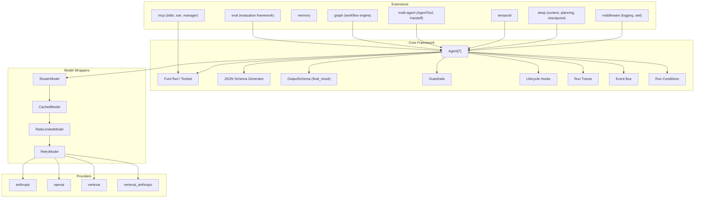

<p align="center">
  <h1 align="center">gollem</h1>
  <p align="center"><strong>The production agent framework for Go</strong></p>
  <p align="center">
    Type-safe agents, structured output, multi-provider streaming, guardrails, observability, and multi-agent orchestration — with zero core dependencies and compile-time guarantees that Python frameworks can't offer.
  </p>
</p>

<p align="center">
  <a href="https://github.com/fugue-labs/gollem/actions/workflows/ci.yml"></a>
  <a href="https://pkg.go.dev/github.com/fugue-labs/gollem"></a>
  <a href="https://goreportcard.com/report/github.com/fugue-labs/gollem"></a>
  <a href="https://codecov.io/gh/fugue-labs/gollem"></a>
  <a href="LICENSE"></a>
  <a href="https://github.com/fugue-labs/gollem"></a>
</p>

---

## Why Gollem?

Python agent frameworks give you runtime validation and hope. Gollem gives you **compile-time type safety**, **zero-allocation streaming**, and a **single-binary deployment story** that eliminates the "works on my machine" class of production failures entirely.

Go's type system isn't a limitation — it's a superpower. When your agent's output schema, tool parameters, guardrail signatures, and event bus subscriptions are all checked at compile time, entire categories of bugs simply cannot exist. No `pydantic.ValidationError` at 3am. No `TypeError: 'NoneType' is not subscriptable` in production. The compiler catches it before your code ever runs.

```bash
go get github.com/fugue-labs/gollem
```

## Features at a Glance

Gollem ships 40+ composable primitives in a single framework. Here's what you get:

### Core Agent Framework
- **Generic `Agent[T]`** — Define output type once; schema generation, validation, and deserialization happen automatically at compile time
- **4 LLM providers** — Anthropic Claude, OpenAI GPT/O-series, Google Gemini (Vertex AI), Claude via Vertex AI
- **`FuncTool[P]` with reflection-based JSON Schema** — Create tools from typed Go functions; parameter schemas generated from struct tags
- **Structured output via "final_result" tool pattern** — Reliable typed extraction across all providers
- **Streaming with `iter.Seq2`** — Go 1.23+ range-over-function iterators for real-time token streaming
- **Node-by-node iteration** — Step through the agent loop one model call at a time with `Agent.Iter`

### Guardrails & Validation
- **Input guardrails** — Validate or transform prompts before the agent loop begins; built-in `MaxPromptLength`, `ContentFilter`
- **Turn guardrails** — Validate message state before each model request; built-in `MaxTurns` limit
- **Tool result validators** — Validate tool outputs before they reach the model; per-tool or agent-wide
- **Output auto-repair** — Automatically fix malformed structured output using a repair model before retrying
- **Output validators** — Custom validation functions on the final typed result

### Observability & Tracing
- **Structured run traces** — Full execution capture with timestamps, durations, and step-level detail
- **Pluggable trace exporters** — `JSONFileExporter`, `ConsoleExporter`, `MultiExporter`, or implement your own
- **Lifecycle hooks** — `OnRunStart`, `OnRunEnd`, `OnModelRequest`, `OnModelResponse`, `OnToolStart`, `OnToolEnd`
- **OpenTelemetry middleware** — Distributed tracing and metrics for model requests out of the box
- **Conversation state snapshots** — Serialize mid-run state for time-travel debugging and branching

### Resilience & Performance
- **Retry with exponential backoff** — `RetryModel` wrapper with jitter, configurable retries, and custom retryable predicates
- **Rate limiting** — Token-bucket `RateLimitedModel` for API throttling with burst capacity
- **Response caching** — `CachedModel` with SHA-256 key derivation and optional TTL
- **Tool execution timeouts** — Per-tool and agent-level deadlines via `context.WithTimeout`
- **Composable run conditions** — `MaxRunDuration`, `ToolCallCount`, `TextContains` with `And`/`Or` combinators
- **Batch execution** — `RunBatch` for concurrent multi-prompt runs with ordered results

### Composition & Multi-Agent
- **Agent cloning** — `Clone()` creates independent copies with additional options
- **Agent chaining** — `ChainRun` pipes one agent's output as the next agent's input with usage aggregation
- **`AgentTool` delegation** — One agent calls another as a tool
- **`Handoff` pipelines** — Sequential agent chains with context filters at boundaries
- **Handoff context filters** — `StripSystemPrompts`, `KeepLastN`, `SummarizeHistory`, composable with `ChainFilters`
- **Typed event bus** — Publish-subscribe coordination with `Subscribe[E]`, `Publish[E]`, and async variants

### Intelligence & Routing
- **Model router** — Route prompts to different models based on content, length, or custom logic
- **Prompt templates** — Go `text/template` syntax with `Partial()` pre-filling and `TemplateVars` interface
- **Conversation memory strategies** — `SlidingWindowMemory`, `TokenBudgetMemory`, `SummaryMemory`
- **Dynamic system prompts** — Generate system prompts at runtime using `RunContext`

### Extensions
- **Graph workflow engine** — Typed state machines with conditional branching, cycle detection, and Mermaid export
- **Deep context management** — Three-tier compression, planning tools, and checkpointing for long-running agents
- **Temporal durable execution** — Fault-tolerant agents with automatic checkpointing via Temporal
- **MCP integration** — Stdio and SSE transports with multi-server management and namespaced tools
- **Evaluation framework** — Datasets, built-in evaluators (`ExactMatch`, `Contains`, `JSONMatch`, `Custom`), LLM-as-judge scoring
- **Middleware chain** — Composable logging, retry, caching, metrics, and custom middleware

### Testing
- **`TestModel` mock** — Test agents without real LLM calls using canned responses and call recording
- **`Override` / `WithTestModel`** — Swap models in tests without modifying the original agent
- **560+ tests** across all packages with zero external test dependencies in core

## Quick Start

### Minimal Example (No API Key Required)

```go
package main

import (
    "context"
    "fmt"
    "log"

    "github.com/fugue-labs/gollem"
)

type CityInfo struct {
    Name       string `json:"name" jsonschema:"description=City name"`
    Country    string `json:"country" jsonschema:"description=Country"`
    Population int    `json:"population" jsonschema:"description=Approximate population"`
}

func main() {
    model := gollem.NewTestModel(
        gollem.ToolCallResponse("final_result", `{"name":"Tokyo","country":"Japan","population":14000000}`),
    )

    agent := gollem.NewAgent[CityInfo](model,
        gollem.WithSystemPrompt[CityInfo]("You are a geography expert."),
    )

    result, err := agent.Run(context.Background(), "Tell me about Tokyo")
    if err != nil {
        log.Fatal(err)
    }

    fmt.Printf("City: %s\n", result.Output.Name)       // Tokyo
    fmt.Printf("Country: %s\n", result.Output.Country)  // Japan
    fmt.Printf("Population: %d\n", result.Output.Population) // 14000000
}
```

### Production Agent with Guardrails, Tracing, and Retry

```go
import (
    "github.com/fugue-labs/gollem"
    "github.com/fugue-labs/gollem/provider/anthropic"
)

model := gollem.NewRetryModel(anthropic.New(), gollem.DefaultRetryConfig())

agent := gollem.NewAgent[Analysis](model,
    // Safety
    gollem.WithInputGuardrail[Analysis]("length", gollem.MaxPromptLength(10000)),
    gollem.WithInputGuardrail[Analysis]("content", gollem.ContentFilter("ignore previous instructions")),
    gollem.WithTurnGuardrail[Analysis]("turns", gollem.MaxTurns(20)),

    // Observability
    gollem.WithTracing[Analysis](),
    gollem.WithTraceExporter[Analysis](gollem.NewJSONFileExporter("./traces")),
    gollem.WithHooks[Analysis](gollem.Hook{
        OnToolStart: func(ctx context.Context, rc *gollem.RunContext, name, args string) {
            log.Printf("tool: %s(%s)", name, args)
        },
    }),

    // Control
    gollem.WithRunCondition[Analysis](gollem.Or(
        gollem.MaxRunDuration(2 * time.Minute),
        gollem.ToolCallCount(50),
    )),
    gollem.WithDefaultToolTimeout[Analysis](30 * time.Second),
)

result, err := agent.Run(ctx, "Analyze Q4 earnings report")
// result.Trace contains full execution trace
```

### Multi-Agent with Event Coordination

```go
bus := gollem.NewEventBus()

type TaskAssigned struct {
    AgentName string
    Task      string
}

gollem.Subscribe[TaskAssigned](bus, func(e TaskAssigned) {
    log.Printf("Agent %s received: %s", e.AgentName, e.Task)
})

researcher := gollem.NewAgent[ResearchResult](model,
    gollem.WithEventBus[ResearchResult](bus),
    gollem.WithSystemPrompt[ResearchResult]("You are a research specialist."),
)

orchestrator := gollem.NewAgent[FinalReport](model,
    gollem.WithEventBus[FinalReport](bus),
    gollem.WithTools[FinalReport](
        gollem.AgentTool("research", "Delegate research tasks", researcher),
    ),
)

result, _ := orchestrator.Run(ctx, "Research and summarize recent advances in robotics")
```

### Batch Processing with Model Routing

```go
// Route simple queries to a fast model, complex ones to a powerful model
router := gollem.NewRouterModel(gollem.ThresholdRouter(
    fastModel,    // short prompts
    powerModel,   // long prompts
    500,          // character threshold
))

agent := gollem.NewAgent[Summary](router)

results := agent.RunBatch(ctx, []string{
    "Summarize: Go is great.",
    "Analyze the geopolitical implications of semiconductor supply chain disruptions across ASEAN nations...",
}, gollem.WithBatchConcurrency(10))

for _, r := range results {
    if r.Err != nil {
        log.Printf("prompt %d failed: %v", r.Index, r.Err)
        continue
    }
    fmt.Println(r.Result.Output)
}
```

## Core Concepts

### Agents

The `Agent[T]` is the central type. It orchestrates the loop of sending messages to an LLM, processing tool calls, and extracting a typed result. The type parameter `T` determines the output type — a struct for structured data, or `string` for free-form text.

```go
// Structured output agent.
agent := gollem.NewAgent[MyStruct](model, opts...)
result, _ := agent.Run(ctx, "prompt")
fmt.Println(result.Output.SomeField)

// Free-form text agent.
textAgent := gollem.NewAgent[string](model, opts...)
textResult, _ := textAgent.Run(ctx, "prompt")
fmt.Println(textResult.Output)
```

### Tools

Tools give agents the ability to call Go functions. Use `FuncTool` to create type-safe tools:

```go
type SearchParams struct {
    Query string `json:"query" jsonschema:"description=Search query"`
    Limit int    `json:"limit" jsonschema:"description=Max results,default=10"`
}

searchTool := gollem.FuncTool[SearchParams](
    "search",
    "Search the knowledge base",
    func(ctx context.Context, params SearchParams) (string, error) {
        return doSearch(params.Query, params.Limit), nil
    },
)

agent := gollem.NewAgent[string](model,
    gollem.WithTools[string](searchTool),
    gollem.WithToolResultValidator[string](func(_ context.Context, name, result string) error {
        if result == "" {
            return fmt.Errorf("empty result from %s", name)
        }
        return nil
    }),
    gollem.WithDefaultToolTimeout[string](10 * time.Second),
)
```

### Structured Output

Gollem uses a "final_result" tool pattern to extract structured output from LLMs. The framework generates a JSON Schema from `T` and presents it as a tool the model must call. If parsing fails, the optional repair function attempts a fix before retrying:

```go
type Analysis struct {
    Sentiment  string   `json:"sentiment" jsonschema:"enum=positive|negative|neutral"`
    Keywords   []string `json:"keywords" jsonschema:"description=Key topics"`
    Confidence float64  `json:"confidence" jsonschema:"description=Confidence 0-1"`
}

agent := gollem.NewAgent[Analysis](model,
    gollem.WithOutputRepair[Analysis](gollem.ModelRepair[Analysis](repairModel)),
    gollem.WithOutputValidator[Analysis](func(a Analysis) error {
        if a.Confidence < 0 || a.Confidence > 1 {
            return fmt.Errorf("confidence out of range: %f", a.Confidence)
        }
        return nil
    }),
)
```

### Streaming

Use `RunStream` for real-time token streaming with Go 1.23+ iterators:

```go
stream, _ := agent.RunStream(ctx, "Write a story about a robot")

for text, err := range stream.StreamText(true) {
    if err != nil {
        log.Fatal(err)
    }
    fmt.Print(text) // prints tokens as they arrive
}

output, _ := stream.GetOutput()
fmt.Printf("\nTokens used: %d\n", output.Usage.TotalTokens())
```

### Providers

All providers implement the `Model` interface, making them interchangeable. Wrap any provider with resilience:

```go
import (
    "github.com/fugue-labs/gollem/provider/anthropic"
    "github.com/fugue-labs/gollem/provider/openai"
    "github.com/fugue-labs/gollem/provider/vertexai"
    "github.com/fugue-labs/gollem/provider/vertexai_anthropic"
)

// Raw providers — each reads credentials from environment.
claude := anthropic.New()
gpt := openai.New()
gemini := vertexai.New("my-project", "us-central1")
vertexClaude := vertexai_anthropic.New("my-project", "us-east5")

// Wrap with retry, rate limiting, and caching.
resilient := gollem.NewRetryModel(
    gollem.NewRateLimitedModel(
        gollem.NewCachedModel(claude, gollem.NewMemoryCacheWithTTL(5*time.Minute)),
        10, // requests per second
        20, // burst capacity
    ),
    gollem.DefaultRetryConfig(),
)
```

| Feature | Anthropic | OpenAI | Vertex AI | Vertex AI Anthropic |
|---------|-----------|--------|-----------|---------------------|
| Structured output | Yes | Yes | Yes | Yes |
| Streaming | Yes | Yes | Yes | Yes |
| Tool use | Yes | Yes | Yes | Yes |
| Extended thinking | Yes | -- | -- | Yes |
| Prompt caching | Yes | -- | -- | Yes |
| Native JSON mode | -- | Yes | Yes | -- |
| Auth | API key | API key | OAuth2 (GCP) | OAuth2 (GCP) |

## Architecture



## Advanced Features

### Prompt Templates

Use Go's `text/template` syntax for dynamic, reusable prompts:

```go
tmpl := gollem.MustTemplate("analyst", `You are a {{.Role}} specializing in {{.Domain}}.
Analyze the following with {{.Depth}} depth.`)

agent := gollem.NewAgent[Analysis](model,
    gollem.WithSystemPromptTemplate[Analysis](tmpl),
)

// Variables resolved from RunContext.Deps
result, _ := agent.Run(ctx, "Analyze Q4 results",
    gollem.WithDeps(map[string]string{
        "Role": "senior analyst", "Domain": "fintech", "Depth": "comprehensive",
    }),
)
```

### Conversation Memory Strategies

Manage context windows intelligently across long conversations:

```go
// Keep only the last 10 message pairs.
agent := gollem.NewAgent[string](model,
    gollem.WithHistoryProcessor[string](gollem.SlidingWindowMemory(10)),
)

// Stay within a token budget.
agent := gollem.NewAgent[string](model,
    gollem.WithHistoryProcessor[string](gollem.TokenBudgetMemory(4000)),
)

// Summarize old messages using a model.
agent := gollem.NewAgent[string](model,
    gollem.WithHistoryProcessor[string](gollem.SummaryMemory(summaryModel, 20)),
)
```

### Agent Composition

Clone agents for variant configurations, or chain them for multi-stage pipelines:

```go
// Clone with overrides — original is never modified.
verbose := agent.Clone(
    gollem.WithTemperature[Analysis](0.9),
    gollem.WithMaxTokens[Analysis](4000),
)

// Chain agents — first output becomes second input.
summary, _ := gollem.ChainRun(ctx, researcher, writer, "Topic: AI safety",
    func(research ResearchResult) string {
        return fmt.Sprintf("Write an article based on: %s", research.Summary)
    },
)
```

### State Snapshots & Time-Travel Debugging

Capture and restore agent state for debugging, branching, or replay:

```go
var checkpoint *gollem.RunSnapshot

agent := gollem.NewAgent[string](model,
    gollem.WithHooks[string](gollem.Hook{
        OnModelResponse: func(ctx context.Context, rc *gollem.RunContext, resp *gollem.ModelResponse) {
            checkpoint = gollem.Snapshot(rc) // capture state
        },
    }),
)

agent.Run(ctx, "original prompt")

// Branch from checkpoint and explore an alternative path.
alt := checkpoint.Branch(func(snap *gollem.RunSnapshot) {
    snap.Prompt = "alternative prompt"
})

// Serialize for storage or debugging.
data, _ := gollem.MarshalSnapshot(checkpoint)
restored, _ := gollem.UnmarshalSnapshot(data)
```

### Graph Workflow Engine

Build typed state machines for complex multi-step workflows:

```go
import "github.com/fugue-labs/gollem/ext/graph"

type OrderState struct {
    OrderID string
    Status  string
    Total   float64
}

g := graph.NewGraph[OrderState]()
g.AddNode(graph.Node[OrderState]{
    Name: "validate",
    Run: func(ctx context.Context, s *OrderState) (string, error) {
        if s.Total <= 0 {
            return graph.EndNode, fmt.Errorf("invalid total")
        }
        return "process", nil
    },
})
g.AddNode(graph.Node[OrderState]{
    Name: "process",
    Run: func(ctx context.Context, s *OrderState) (string, error) {
        s.Status = "processed"
        return graph.EndNode, nil
    },
})
g.SetEntryPoint("validate")

finalState, _ := g.Run(ctx, OrderState{OrderID: "123", Total: 99.99})
```

### Deep Context Management

Three-tier context compression for agents that handle massive context windows:

```go
import "github.com/fugue-labs/gollem/ext/deep"

cm := deep.NewContextManager(model,
    deep.WithMaxContextTokens(100000),
    deep.WithOffloadThreshold(20000),
    deep.WithCompressionThreshold(0.85),
)

agent := gollem.NewAgent[string](model,
    gollem.WithHistoryProcessor[string](cm.AsHistoryProcessor()),
)

// Or use the all-in-one LongRunAgent.
lra := deep.NewLongRunAgent[string](model,
    deep.WithContextWindow[string](100000),
    deep.WithPlanningEnabled[string](),
)
result, _ := lra.Run(ctx, "Analyze this large codebase...")
```

### Temporal Durable Execution

Fault-tolerant agents with automatic retries and checkpointing:

```go
import "github.com/fugue-labs/gollem/ext/temporal"

ta := temporal.NewTemporalAgent(agent,
    temporal.WithName("my-agent"),
    temporal.WithActivityConfig(temporal.ActivityConfig{
        StartToCloseTimeout: 120 * time.Second,
        MaxRetries:          3,
    }),
)
```

### Evaluation Framework

Test agent quality with datasets and composable evaluators:

```go
import "github.com/fugue-labs/gollem/ext/eval"

dataset := eval.Dataset[string]{
    Name: "geography",
    Cases: []eval.Case[string]{
        {Name: "capital-france", Prompt: "What is the capital of France?", Expected: "Paris"},
        {Name: "capital-japan", Prompt: "What is the capital of Japan?", Expected: "Tokyo"},
    },
}

runner := eval.NewRunner(agent, eval.Contains())
report, _ := runner.Run(ctx, dataset)
fmt.Printf("Score: %.0f%% (%d/%d passed)\n",
    report.AvgScore*100, report.PassedCases, report.TotalCases)
```

### MCP Integration

Connect to Model Context Protocol servers for external tool discovery:

```go
import mcpclient "github.com/fugue-labs/gollem/ext/mcp"

client, _ := mcpclient.NewStdioClient(ctx, "npx", "-y", "@modelcontextprotocol/server-filesystem", "/tmp")
defer client.Close()

// Multi-server manager with namespaced tools.
mgr := mcpclient.NewManager()
mgr.AddClient("fs", client)
mgr.AddClient("db", sseClient)
allTools, _ := mgr.Tools(ctx) // "fs__read", "db__query", etc.
```

### Middleware

Compose cross-cutting concerns around model requests:

```go
import "github.com/fugue-labs/gollem/ext/middleware"

wrapped := middleware.Wrap(model,
    middleware.NewLogging(logger),
    middleware.NewOTel("my-service"),
)

agent := gollem.NewAgent[string](wrapped)
```

## Examples

| Example | Description |
|---------|-------------|
| [`examples/simple`](examples/simple) | Basic `Agent[CityInfo]` with structured output |
| [`examples/tools`](examples/tools) | Tool use with `FuncTool` |
| [`examples/streaming`](examples/streaming) | Real-time streaming with `iter.Seq2` |
| [`examples/multi-provider`](examples/multi-provider) | Same agent across different providers |
| [`examples/mcp`](examples/mcp) | MCP server integration |
| [`examples/temporal`](examples/temporal) | Temporal durable execution setup |
| [`examples/evaluation`](examples/evaluation) | Evaluation framework with datasets |
| [`examples/multi-agent/delegation`](examples/multi-agent/delegation) | Agent-as-tool delegation |
| [`examples/deep/context_management`](examples/deep/context_management) | Three-tier context compression |
| [`examples/graph`](examples/graph) | Graph workflow state machine |

## Testing

Gollem provides `TestModel` and test helpers for verifying agent logic without real LLM calls:

```go
func TestMyAgent(t *testing.T) {
    model := gollem.NewTestModel(
        gollem.ToolCallResponse("final_result", `{"status":"ok"}`),
    )

    agent := gollem.NewAgent[MyOutput](model)
    result, err := agent.Run(context.Background(), "test prompt")

    require.NoError(t, err)
    assert.Equal(t, "ok", result.Output.Status)

    // Inspect what was sent to the model.
    calls := model.Calls()
    assert.Len(t, calls, 1)
}

func TestWithOverride(t *testing.T) {
    // Swap model in production agent without modifying original.
    testAgent, testModel := gollem.WithTestModel[MyOutput](productionAgent,
        gollem.ToolCallResponse("final_result", `{"status":"ok"}`),
    )
    result, _ := testAgent.Run(ctx, "test")
    assert.Equal(t, 1, len(testModel.Calls()))
}
```

## Contributing

Contributions are welcome. Please see [CONTRIBUTING.md](CONTRIBUTING.md) for development setup, code style, testing requirements, and the pull request process.

## License

MIT License — Copyright (c) 2026 [Trevor Prater](https://github.com/trevorprater)

See [LICENSE](LICENSE) for the full text.
