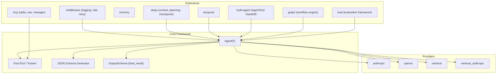

<p align="center">
  <h1 align="center">gollem</h1>
  <p align="center"><strong>The Go Agent Framework</strong></p>
  <p align="center">
    Build production-grade LLM agents with structured output, tool use, streaming, and multi-provider support — all with compile-time type safety.
  </p>
</p>

<p align="center">
  <a href="https://github.com/fugue-labs/gollem/actions/workflows/ci.yml"></a>
  <a href="https://pkg.go.dev/github.com/fugue-labs/gollem"></a>
  <a href="https://goreportcard.com/report/github.com/fugue-labs/gollem"></a>
  <a href="https://codecov.io/gh/trevorprater/gollem"></a>
  <a href="LICENSE"></a>
</p>

---

## Features

- **Generic `Agent[T]` with compile-time type safety** -- Define your output type once; the agent handles schema generation, validation, and deserialization automatically
- **4 LLM providers** -- Anthropic Claude, OpenAI GPT/O-series, Google Gemini via Vertex AI, and Claude via Vertex AI Anthropic
- **`FuncTool` with reflection-based JSON Schema generation** -- Create tools from typed Go functions; parameter schemas are generated from struct tags
- **Structured output via "final_result" tool pattern** -- Extract typed data from LLM responses using a synthetic tool call, ensuring reliable parsing
- **Streaming with `iter.Seq2` iterators** -- Go 1.23+ range-over-function support for real-time token streaming
- **Dynamic system prompts** -- Generate system prompts at runtime using `RunContext` for context-aware instructions
- **History processors** -- Transform message history before each model request for context management
- **Human-in-the-loop tool approval** -- Require user confirmation before executing sensitive tool calls
- **Node-by-node agent iteration** -- Step through the agent loop one model call at a time with `Agent.Iter`
- **Concurrency and tool call limits** -- Control parallel tool execution and enforce usage budgets
- **Toolsets for grouped tool management** -- Organize tools into named groups for modular configuration
- **Deep package: context compression, planning tool, checkpointing** -- Three-tier context compression, persistent planning, and checkpoint save/load for long-running agents
- **Multi-agent: `AgentTool` delegation, `Handoff` pipelines** -- Compose agents as tools or chain them in sequential pipelines
- **Graph engine for typed workflow state machines** -- Define directed graphs with conditional branching, cycle detection, and Mermaid diagram generation
- **Temporal durable execution** -- Wrap agents for fault-tolerant execution with automatic checkpointing via Temporal
- **MCP integration** -- Connect to Model Context Protocol servers via stdio and SSE transports with multi-server management
- **Evaluation framework with LLM-as-judge** -- Test agent quality with datasets, built-in evaluators (ExactMatch, Contains, JSONMatch, Custom), and LLM-based scoring
- **OpenTelemetry middleware** -- Distributed tracing and metrics for model requests out of the box
- **Middleware chain** -- Composable middleware for logging, retry, caching, metrics, and custom cross-cutting concerns
- **Memory system** -- Conversation memory for multi-turn agent interactions
- **`TestModel` mock for testing** -- Test agents without real LLM calls using canned responses and call recording

## Quick Start

### Installation

```bash
go get github.com/fugue-labs/gollem
```

### Minimal Example (No API Key Required)

This example uses `TestModel` to demonstrate the agent framework without any LLM provider configuration:

```go
package main

import (
    "context"
    "fmt"
    "log"

    "github.com/fugue-labs/gollem"
)

// CityInfo is the structured output type the agent will produce.
type CityInfo struct {
    Name       string `json:"name" jsonschema:"description=City name"`
    Country    string `json:"country" jsonschema:"description=Country"`
    Population int    `json:"population" jsonschema:"description=Approximate population"`
}

func main() {
    // Create a TestModel with a canned tool call response.
    // The response calls the "final_result" tool with our structured output.
    model := gollem.NewTestModel(
        gollem.ToolCallResponse("final_result", `{"name":"Tokyo","country":"Japan","population":14000000}`),
    )

    // Create an agent that returns structured CityInfo.
    agent := gollem.NewAgent[CityInfo](model,
        gollem.WithSystemPrompt[CityInfo]("You are a geography expert."),
    )

    result, err := agent.Run(context.Background(), "Tell me about Tokyo")
    if err != nil {
        log.Fatal(err)
    }

    fmt.Printf("City: %s\n", result.Output.Name)
    fmt.Printf("Country: %s\n", result.Output.Country)
    fmt.Printf("Population: %d\n", result.Output.Population)
}
```

### With a Real Provider

```go
import "github.com/fugue-labs/gollem/provider/anthropic"

model := anthropic.New() // reads ANTHROPIC_API_KEY from environment
agent := gollem.NewAgent[CityInfo](model,
    gollem.WithSystemPrompt[CityInfo]("You are a geography expert."),
)
result, err := agent.Run(ctx, "Tell me about Tokyo")
```

## Core Concepts

### Agents

The `Agent[T]` is the central type. It orchestrates the loop of sending messages to an LLM, processing tool calls, and extracting a typed result. The type parameter `T` determines the output type -- it can be a struct for structured data, or `string` for free-form text.

```go
// Structured output agent.
agent := gollem.NewAgent[MyStruct](model, opts...)
result, _ := agent.Run(ctx, "prompt")
fmt.Println(result.Output.SomeField)

// Free-form text agent.
textAgent := gollem.NewAgent[string](model, opts...)
textResult, _ := textAgent.Run(ctx, "prompt")
fmt.Println(textResult.Output)
```

Agents are configured via functional options:

| Option | Description |
|--------|-------------|
| `WithSystemPrompt` | Static system prompt |
| `WithDynamicSystemPrompt` | Runtime-generated system prompt |
| `WithTools` | Register callable tools |
| `WithToolsets` | Register grouped tool collections |
| `WithToolApproval` | Human-in-the-loop approval function |
| `WithHistoryProcessor` | Transform message history before requests |
| `WithMaxRetries` | Maximum validation/retry attempts |
| `WithMaxConcurrency` | Limit parallel tool execution |
| `WithTemperature` | Model temperature setting |
| `WithMaxTokens` | Maximum output tokens |
| `WithUsageLimits` | Token and request budgets |
| `WithEndStrategy` | Early (default) or exhaustive result handling |
| `WithOutputValidator` | Custom output validation functions |

### Tools

Tools give agents the ability to call Go functions. Use `FuncTool` to create type-safe tools from regular functions:

```go
type SearchParams struct {
    Query string `json:"query" jsonschema:"description=Search query"`
    Limit int    `json:"limit" jsonschema:"description=Max results,default=10"`
}

searchTool := gollem.FuncTool[SearchParams](
    "search",
    "Search the knowledge base",
    func(ctx context.Context, params SearchParams) (string, error) {
        results := doSearch(params.Query, params.Limit)
        return results, nil
    },
)
```

The JSON Schema for the tool parameters is generated automatically from the struct tags. Tools can also accept a `*RunContext` parameter for access to agent state:

```go
gollem.FuncTool[Params]("name", "desc",
    func(ctx context.Context, rc *gollem.RunContext, params Params) (string, error) {
        fmt.Printf("Run step: %d, retries: %d\n", rc.RunStep, rc.Retry)
        return "result", nil
    },
)
```

Tool options include `WithToolMaxRetries`, `WithToolSequential`, `WithToolStrict`, and `WithRequiresApproval`.

### Structured Output

Gollem uses a "final_result" tool pattern to extract structured output from LLMs. When you create an `Agent[T]`, the framework automatically generates a JSON Schema from `T` and presents it as a tool the model must call to return its result. This approach works reliably across all providers.

```go
type Analysis struct {
    Sentiment  string   `json:"sentiment" jsonschema:"description=positive/negative/neutral,enum=positive|negative|neutral"`
    Keywords   []string `json:"keywords" jsonschema:"description=Key topics identified"`
    Confidence float64  `json:"confidence" jsonschema:"description=Confidence score 0-1"`
}

agent := gollem.NewAgent[Analysis](model)
result, _ := agent.Run(ctx, "Analyze: The product launch exceeded all expectations")
fmt.Printf("Sentiment: %s (%.0f%% confidence)\n", result.Output.Sentiment, result.Output.Confidence*100)
```

### Streaming

Use `RunStream` for real-time token streaming with Go 1.23+ iterators:

```go
stream, _ := agent.RunStream(ctx, "Write a story about a robot")

for text, err := range stream.StreamText(true) {
    if err != nil {
        log.Fatal(err)
    }
    fmt.Print(text) // prints tokens as they arrive
}

output, _ := stream.GetOutput()
fmt.Printf("\nTokens used: %d\n", output.Usage.TotalTokens())
```

### Node-by-Node Iteration

For fine-grained control, use `Iter` to step through the agent loop manually:

```go
run := agent.Iter(ctx, "prompt")
for !run.Done() {
    resp, err := run.Next()
    if err != nil {
        break
    }
    fmt.Printf("Step response: %s\n", resp.TextContent())
}
result, _ := run.Result()
```

### Providers

All providers implement the `Model` interface, making them interchangeable:

```go
type Model interface {
    Request(ctx context.Context, messages []ModelMessage, settings *ModelSettings, params *ModelRequestParameters) (*ModelResponse, error)
    RequestStream(ctx context.Context, messages []ModelMessage, settings *ModelSettings, params *ModelRequestParameters) (StreamedResponse, error)
    ModelName() string
}
```

Create providers with sensible defaults or explicit configuration:

```go
import (
    "github.com/fugue-labs/gollem/provider/anthropic"
    "github.com/fugue-labs/gollem/provider/openai"
    "github.com/fugue-labs/gollem/provider/vertexai"
    "github.com/fugue-labs/gollem/provider/vertexai_anthropic"
)

// Each provider reads credentials from environment variables by default.
claudeModel := anthropic.New()
gptModel := openai.New()
geminiModel := vertexai.New("my-project", "us-central1")
vertexClaudeModel := vertexai_anthropic.New("my-project", "us-east5")
```

## Architecture



## Provider Comparison

| Feature | Anthropic | OpenAI | Vertex AI | Vertex AI Anthropic |
|---------|-----------|--------|-----------|---------------------|
| Structured output | Yes | Yes | Yes | Yes |
| Streaming | Yes | Yes | Yes | Yes |
| Tool use | Yes | Yes | Yes | Yes |
| Extended thinking | Yes | -- | -- | Yes |
| Prompt caching | Yes | -- | -- | Yes |
| Native JSON mode | -- | Yes | Yes | -- |
| Auth | API key | API key | OAuth2 (GCP) | OAuth2 (GCP) |

## Advanced Features

### Deep Package -- Context Management

The `deep` package provides tools for long-running agent tasks that may exceed context limits:

```go
import "github.com/fugue-labs/gollem/ext/deep"

// Three-tier context compression.
cm := deep.NewContextManager(model,
    deep.WithMaxContextTokens(100000),
    deep.WithOffloadThreshold(20000),
    deep.WithCompressionThreshold(0.85),
)

// Use as a history processor.
agent := gollem.NewAgent[string](model,
    gollem.WithHistoryProcessor[string](cm.AsHistoryProcessor()),
)

// Or use the all-in-one LongRunAgent.
lra := deep.NewLongRunAgent[string](model,
    deep.WithContextWindow[string](100000),
    deep.WithPlanningEnabled[string](),
)
result, _ := lra.Run(ctx, "Analyze this large codebase...")
```

### Multi-Agent Patterns

**Agent delegation** -- One agent calls another as a tool:

```go
researcher := gollem.NewAgent[ResearchResult](model,
    gollem.WithSystemPrompt[ResearchResult]("You are a research specialist."),
)

orchestrator := gollem.NewAgent[FinalReport](model,
    gollem.WithTools[FinalReport](
        gollem.AgentTool("research", "Delegate research tasks", researcher),
    ),
)
```

**Handoff pipelines** -- Chain agents in sequence:

```go
pipeline := gollem.NewHandoff[string]()
pipeline.AddStep("draft", draftAgent, nil)
pipeline.AddStep("review", reviewAgent, func(prev string) string {
    return "Review this draft: " + prev
})
result, _ := pipeline.Run(ctx, "Write an article about Go generics")
```

### Graph Workflow Engine

Build typed state machines for complex multi-step workflows:

```go
import "github.com/fugue-labs/gollem/ext/graph"

type OrderState struct {
    OrderID string
    Status  string
    Total   float64
}

g := graph.NewGraph[OrderState]()
g.AddNode(graph.Node[OrderState]{
    Name: "validate",
    Run: func(ctx context.Context, s *OrderState) (string, error) {
        if s.Total <= 0 {
            return graph.EndNode, fmt.Errorf("invalid total")
        }
        return "process", nil
    },
})
g.AddNode(graph.Node[OrderState]{
    Name: "process",
    Run: func(ctx context.Context, s *OrderState) (string, error) {
        s.Status = "processed"
        return graph.EndNode, nil
    },
})
g.SetEntryPoint("validate")

finalState, _ := g.Run(ctx, OrderState{OrderID: "123", Total: 99.99})
```

### Temporal Durable Execution

Wrap agents for fault-tolerant execution with automatic retries and checkpointing:

```go
import "github.com/fugue-labs/gollem/ext/temporal"

ta := temporal.NewTemporalAgent(agent,
    temporal.WithName("my-agent"),
    temporal.WithActivityConfig(temporal.ActivityConfig{
        StartToCloseTimeout: 120 * time.Second,
        MaxRetries:          3,
    }),
)

// Register activities with a Temporal worker.
activities := ta.Activities()
// Each activity name -> function can be registered with worker.RegisterActivity.
```

### Evaluation Framework

Test agent quality with datasets and composable evaluators:

```go
import "github.com/fugue-labs/gollem/ext/eval"

dataset := eval.Dataset[string]{
    Name: "geography",
    Cases: []eval.Case[string]{
        {Name: "capital-france", Prompt: "What is the capital of France?", Expected: "Paris"},
        {Name: "capital-japan", Prompt: "What is the capital of Japan?", Expected: "Tokyo"},
    },
}

runner := eval.NewRunner(agent, eval.Contains())
report, _ := runner.Run(ctx, dataset)
fmt.Printf("Score: %.0f%% (%d/%d passed)\n",
    report.AvgScore*100, report.PassedCases, report.TotalCases)
```

### MCP Integration

Connect to Model Context Protocol servers for external tool discovery:

```go
import mcpclient "github.com/fugue-labs/gollem/ext/mcp"

// Stdio transport.
client, _ := mcpclient.NewStdioClient(ctx, "npx", "-y", "@modelcontextprotocol/server-filesystem", "/tmp")
defer client.Close()
tools, _ := client.Tools(ctx)

// SSE transport.
sseClient, _ := mcpclient.NewSSEClient(ctx, "http://localhost:8080/sse")
defer sseClient.Close()

// Multi-server manager with namespaced tools.
mgr := mcpclient.NewManager()
mgr.AddClient("fs", client)
mgr.AddClient("db", sseClient)
allTools, _ := mgr.Tools(ctx) // tools namespaced as "fs__toolname", "db__toolname"
```

### Middleware

Compose cross-cutting concerns around model requests:

```go
import "github.com/fugue-labs/gollem/ext/middleware"

// Wrap a model with middleware.
wrapped := middleware.Wrap(model,
    middleware.NewLogging(logger),
    middleware.NewOTel("my-service"),
)

// Use the wrapped model exactly like the original.
agent := gollem.NewAgent[string](wrapped)
```

## Examples

| Example | Description |
|---------|-------------|
| [`examples/simple`](examples/simple) | Basic `Agent[CityInfo]` with structured output |
| [`examples/tools`](examples/tools) | Tool use with `FuncTool` |
| [`examples/streaming`](examples/streaming) | Real-time streaming with `iter.Seq2` |
| [`examples/multi-provider`](examples/multi-provider) | Same agent across different providers |
| [`examples/mcp`](examples/mcp) | MCP server integration |
| [`examples/temporal`](examples/temporal) | Temporal durable execution setup |
| [`examples/evaluation`](examples/evaluation) | Evaluation framework with datasets |
| [`examples/multi-agent/delegation`](examples/multi-agent/delegation) | Agent-as-tool delegation |
| [`examples/deep/context_management`](examples/deep/context_management) | Three-tier context compression |
| [`examples/graph`](examples/graph) | Graph workflow state machine |

## Testing

Gollem provides a built-in `TestModel` mock that enables testing agent logic without real LLM calls:

```go
func TestMyAgent(t *testing.T) {
    model := gollem.NewTestModel(
        gollem.ToolCallResponse("final_result", `{"status":"ok"}`),
    )

    agent := gollem.NewAgent[MyOutput](model)
    result, err := agent.Run(context.Background(), "test prompt")

    require.NoError(t, err)
    assert.Equal(t, "ok", result.Output.Status)

    // Inspect what was sent to the model.
    calls := model.Calls()
    assert.Len(t, calls, 1)
}
```

`TestModel` supports multiple canned responses for multi-turn conversations and tool call flows. It records all calls for assertion, making it straightforward to verify that your agent sends the right messages.

## Contributing

Contributions are welcome. Please see [CONTRIBUTING.md](CONTRIBUTING.md) for development setup, code style, testing requirements, and the pull request process.

## License

MIT License -- Copyright (c) 2026 [Trevor Prater](https://github.com/trevorprater)

See [LICENSE](LICENSE) for the full text.
